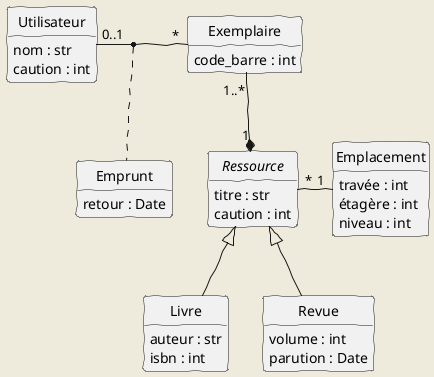

test graphique

```plantuml
@startuml
skinparam handwritten true
skinparam backgroundColor #EEEBDC
class Utilisateur {
    nom : str
    caution : int
}
class Exemplaire {
    code_barre : int
}
abstract class Ressource {
    titre : str
    caution : int
}
class Livre {
    auteur : str
    isbn : int
}
class Revue {
    volume : int
    parution : Date
}
class Emplacement {
    travée : int
    étagère : int
    niveau : int
}
class Emprunt {
    retour : Date
}
Utilisateur "0..1"-right-"*" Exemplaire
(Utilisateur, Exemplaire) . Emprunt
Exemplaire "1..*"--*"1" Ressource
Ressource <|-- Livre
Ressource <|-- Revue
Ressource "*"-right-"1" Emplacement
hide circle
hide empty members
@enduml

```
